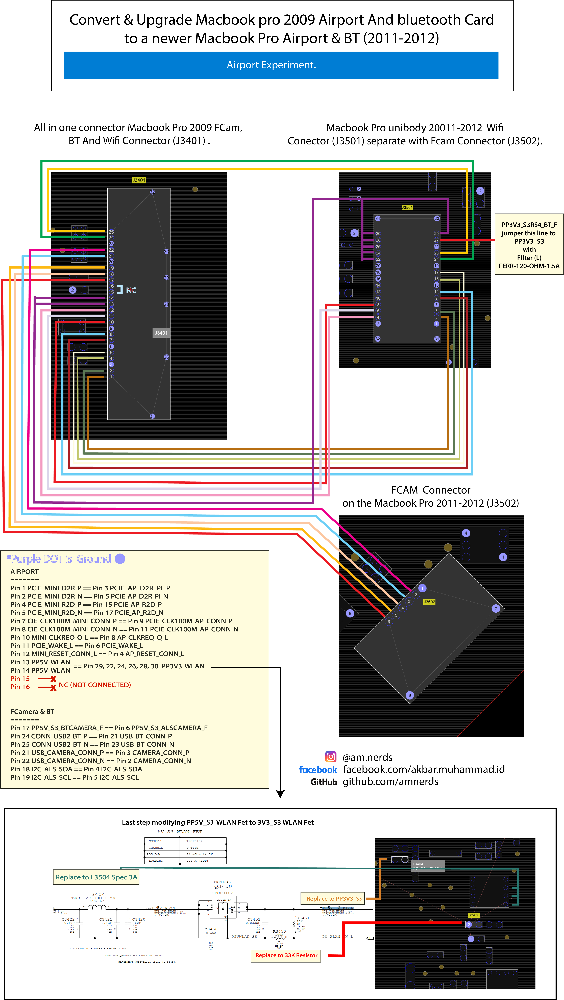

# Convert &amp; Upgrade Macbook pro 2009 Airport And bluetooth Card to a newer Macbook Pro Airport &amp; BT (2011-2012)

## 🚦 Wrap Up

If you think any of the Schema and boardview can be improved, feel free to discuss it in the issues. Also, I will continue to improve this, so you might want to watch this repository.

## 🙌 Contribution

- Open pull request with improvements
- Discuss ideas in issues
- Spread the word
 
## License

Have a look at the [license file](./LICENSE) for details
